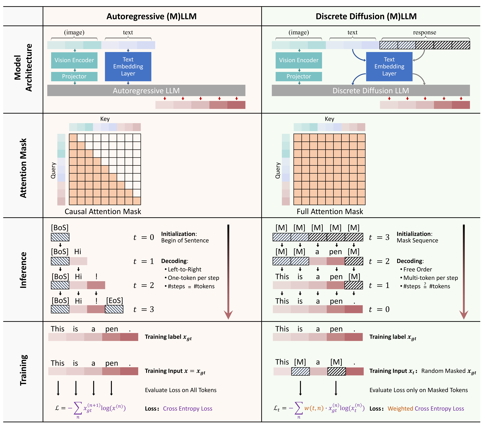
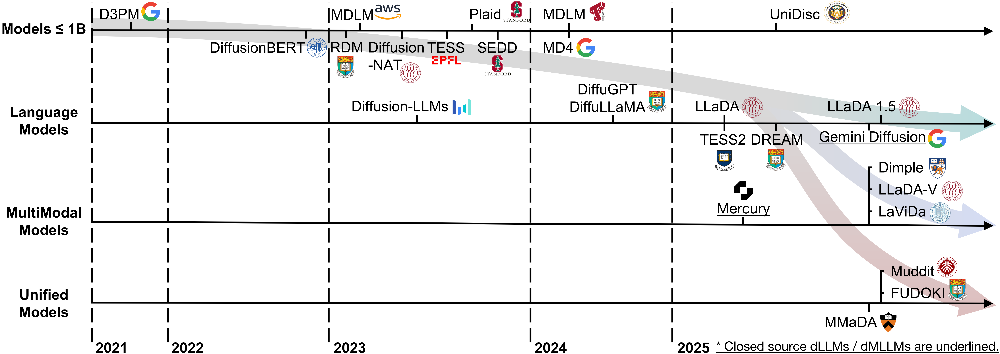

<div align="center">

  <h2><b> Discrete Diffusion in Large Language and Multimodal Models: A Survey </b></h2>
  <h4> An overview of research in discrete diffusion large language and multimodal models</h4>

</div>


<div align="center">
    <div style="max-width: 100%; text-align: left; margin-bottom: 20px;">
        
    </div>
</div>
Figure 1. Difference between autoregressive models and discrete diffusion models.
     
<div align="center">

<div align="center">
    <div style="max-width: 100%; text-align: left; margin-bottom: 20px;">
        
    </div>
</div>
Figure 2. A timeline of existing dLLMs and dMLLMs in recent years.     
<div align="center">


<a href="https://arxiv.org/abs/2504.10903" target="_blank"></a>

</div>

<div align="center">

**[<a href="https://arxiv.org/abs/2504.10903">arXiv</a>]** **[<a href="https://huggingface.co/papers/2504.10903">HuggingFace</a>]** **[<a href="https://x.com/si_feng32704/status/1912378179718901843">X</a>]**

</div>


This repository is for our paper:

> **[Discrete Diffusion in Large Language and Multimodal Models: A Survey](https://arxiv.org/abs/****)** \
> [Runpeng Yu*](https://fscdc.github.io/)<sup>1</sup>, [Qi Li*](https://fangggf.github.io/)<sup>1</sup>, [Xinchao Wang](https://sites.google.com/site/sitexinchaowang/)<sup>†1</sup> \
> <sup>1</sup>National University of Singapore, Singapore \
> <sup>*</sup>Equal contribution, random order. \
> <sup>†</sup>Corresponding author: xinchao@nus.edu.sg

---
>
> 🙋 Please let us know if you find out a mistake or have any suggestions!
> 
> 🌟 If you find this resource helpful, please consider to star this repository and cite our [research](#citation)!

<p align="center">

</p>


## Updates
- 2025-04-16: 📝 The survey is now available on [arXiv](https://arxiv.org/abs/****)!
- 2025-06-17: 🚀 Our dLLM survey Repo is launched!


##

> **What to add your papers to the repo?**
>
> If you want to add your paper or update details like conference info or code URLs, please raise an issue. You can generate the necessary markdown for each paper by filling out `generate_item.py` and running `python generate_item.py`. We greatly appreciate your contributions. Alternatively, you can email me ([Gmail](fscnkucs@gmail.com)) the links to your paper and code, and I will add your paper to the list as soon as possible.

---
<p align="center">

</p>

### Quick Links

- [Mathematics](#mathematics)
  - [Discrete Denoising Diffusion Probabilistic Model](#discrete-denoising-diffusion-probabilistic-model)
  - [Reparameterized Discrete Diffusion Model](#reparameterized-discrete-diffusion-model)
  - [Concrete Score](#concrete-score)
- [Representative Model](#representative-model)
  - [Discrete Diffusion Models around 1B](#discrete-diffusion-models-around-1b)
  - [Large Diffusion Language Models](#large-diffusion-language-models)
  - [Large Diffusion Multimodal Models](#large-diffusion-multimodal-models)
  - [Large Unified Models](#large-unified-models)
  - [Training Techniques](#training-techniques)
  - [Initialization Technique](#initialization-technique)
  - [Complementary Masking Technique](#complementary-masking-technique)
  - [Masking Scheduling Technique](#masking-scheduling-technique)
- [Inference Techniques](#inference-techniques)
  - [Unmasking Techniques](#unmasking-techniques)
  - [Remasking Techniques](#remasking-techniques)
  - [Prefilling and Caching Technique](#prefilling-and-caching-technique)
  - [Guidance Technique](#guidance-technique)
- [Applications](#applications)
  - [Text Generation and Style Control](#text-generation-and-style-control)
  - [Text Editing and Summarization](#text-editing-and-summarization)
  - [Sentiment Analysis and Data Augmentation](#sentiment-analysis-and-data-augmentation)
  - [Knowledge and Reasoning](#knowledge-and-reasoning)
  - [Vision and Multimodal](#vision-and-multimodal)
  - [Biological and Drug Discovery](#biological-and-drug-discovery)


### Mathematics

#### Discrete Denoising Diffusion Probabilistic Model
| Title & Authors | Introduction | Links |
|:--|  :----: | :---:|
|[Deep unsupervised learning using nonequilibrium thermodynamics](https://proceedings.neurips.cc/paper/2021/file/958c530554f78bcd8e97125b70e6973d-Paper.pdf) <br> Sohl-Dickstein, Jascha, Eric Weiss, Niru Maheswaranathan, Surya Ganguli | |[Paper](https://proceedings.neurips.cc/paper/2021/file/958c530554f78bcd8e97125b70e6973d-Paper.pdf)|[//]: #06/16
|[Structured denoising diffusion models in discrete state-spaces](https://proceedings.neurips.cc/paper/2021/file/958c530554f78bcd8e97125b70e6973d-Paper.pdf) <br> Austin, Jacob, Daniel D. Johnson, Jonathan Ho, Daniel Tarlow, Rianne Van Den Berg | |[Paper](https://proceedings.neurips.cc/paper/2021/file/958c530554f78bcd8e97125b70e6973d-Paper.pdf)|[//]: #06/16
|[Argmax flows and multinomial diffusion: Learning categorical distributions](https://proceedings.neurips.cc/paper/2021/file/67d96d458abdef21792e6d8e590244e7-Paper.pdf) <br> Hoogeboom, Emiel, Didrik Nielsen, Priyank Jaini, Patrick Forré, Max Welling | |[Paper](https://proceedings.neurips.cc/paper/2021/file/67d96d458abdef21792e6d8e590244e7-Paper.pdf)|[//]: #06/16

#### Reparameterized Discrete Diffusion Model
| Title & Authors | Introduction | Links |
|:--|  :----: | :---:|
|[A Reparameterized Discrete Diffusion Model for Text Generation](https://arxiv.org/pdf/2302.05737) <br> Lin Zheng, Jianbo Yuan, Lei Yu, Lingpeng Kong | |[Paper](https://arxiv.org/pdf/2302.05737)|[//]: #06/16
|[Simple and Effective Masked Diffusion Language Models](https://arxiv.org/pdf/2406.07524) <br> Subham Sekhar Sahoo, Marianne Arriola, Yair Schiff, Aaron Gokaslan, Edgar Marroquin, Justin T Chiu, Alexander Rush, Volodymyr Kuleshov | |[Paper](https://arxiv.org/pdf/2406.07524)|[//]: #06/16
|[Simplified and Generalized Masked Diffusion for Discrete Data](https://arxiv.org/abs/2406.04329) <br> Jiaxin Shi, Kehang Han, Zhe Wang, Arnaud Doucet, Michalis K. Titsias | |[Paper](https://arxiv.org/abs/2406.04329)|[//]: #06/17


#### Concrete Score
| Title & Authors | Introduction | Links |
|:--|  :----: | :---:|
|[Concrete Score Matching: Generalized Score Matching for Discrete Data](https://papers.nips.cc/paper_files/paper/2022/file/df04a35d907e894d59d4eab1f92bc87b-Supplemental-Conference.pdf) <br> Chenlin Meng, Kristy Choi, Jiaming Song, Stefano Ermon | |[Paper](https://papers.nips.cc/paper_files/paper/2022/file/df04a35d907e894d59d4eab1f92bc87b-Supplemental-Conference.pdf)|[//]: #06/17
|[Simple and Effective Masked Diffusion Language Models](https://arxiv.org/pdf/2406.07524) <br> Subham Sekhar Sahoo, Marianne Arriola, Yair Schiff, Aaron Gokaslan, Edgar Marroquin, Justin T Chiu, Alexander Rush, Volodymyr Kuleshov | |[Paper](https://arxiv.org/pdf/2406.07524)|[//]: #06/16
|[Score-based Continuous-time Discrete Diffusion Models](https://arxiv.org/abs/2211.16750) <br> Haoran Sun, Lijun Yu, Bo Dai, Dale Schuurmans, Hanjun Dai | |[Paper](https://arxiv.org/abs/2211.16750)|[//]: #06/17
|[Your Absorbing Discrete Diffusion Secretly Models the Conditional Distributions of Clean Data](https://arxiv.org/abs/2406.03736) <br> Jingyang Ou, Shen Nie, Kaiwen Xue, Fengqi Zhu, Jiacheng Sun, Zhenguo Li, Chongxuan Li | |[Paper](https://arxiv.org/abs/2406.03736)|[//]: #06/17


### Representative Model

#### Discrete Diffusion Models around 1B
| Title & Authors | Introduction | Links |
|:--|  :----: | :---:|
|[Structured Denoising Diffusion Models in Discrete State-Spaces](https://arxiv.org/abs/2107.03006) <br> Jacob Austin, Daniel D. Johnson, Jonathan Ho, Daniel Tarlow, Rianne van den Berg | |[Paper](https://arxiv.org/abs/2107.03006)|[//]: #06/17
|[DiffusionBERT: Improving Generative Masked Language Models with Diffusion Models](https://arxiv.org/abs/2211.15029) <br> Zhengfu He, Tianxiang Sun, Kuanning Wang, Xuanjing Huang, Xipeng Qiu | |[Paper](https://arxiv.org/abs/2211.15029)|[//]: #06/17
|[A Reparameterized Discrete Diffusion Model for Text Generation](https://arxiv.org/abs/2302.05737) <br> Lin Zheng, Jianbo Yuan, Lei Yu, Lingpeng Kong | |[Paper](https://arxiv.org/abs/2302.05737)|[//]: #06/17
|[A Cheaper and Better Diffusion Language Model with Soft-Masked Noise](https://arxiv.org/abs/2304.04746) <br> Jiaao Chen, Aston Zhang, Mu Li, Alex Smola, Diyi Yang | |[Paper](https://arxiv.org/abs/2304.04746)|[//]: #06/17
|[Diffusion-NAT: Self-Prompting Discrete Diffusion for Non-Autoregressive Text Generation](https://arxiv.org/abs/2305.04044) <br> Kun Zhou, Yifan Li, Wayne Xin Zhao, Ji-Rong Wen | |[Paper](https://arxiv.org/abs/2305.04044)|[//]: #06/17
|[TESS: Text-to-Text Self-Conditioned Simplex Diffusion](https://arxiv.org/abs/2305.08379) <br> Rabeeh Karimi Mahabadi, Hamish Ivison, Jaesung Tae, James Henderson, Iz Beltagy, Matthew E. Peters, Arman Cohan | |[Paper](https://arxiv.org/abs/2305.08379)|[//]: #06/17
|[Likelihood-Based Diffusion Language Models](https://arxiv.org/abs/2305.18619) <br> Ishaan Gulrajani, Tatsunori B. Hashimoto | |[Paper](https://arxiv.org/abs/2305.18619)|[//]: #06/17
|[Discrete Diffusion Modeling by Estimating the Ratios of the Data Distribution](https://arxiv.org/abs/2310.16834) <br> Aaron Lou, Chenlin Meng, Stefano Ermon | |[Paper](https://arxiv.org/abs/2310.16834)|[//]: #06/17
|[Simple and Effective Masked Diffusion Language Models](https://arxiv.org/pdf/2406.07524) <br> Subham Sekhar Sahoo, Marianne Arriola, Yair Schiff, Aaron Gokaslan, Edgar Marroquin, Justin T Chiu, Alexander Rush, Volodymyr Kuleshov | |[Paper](https://arxiv.org/pdf/2406.07524)|[//]: #06/16
|[Simplified and Generalized Masked Diffusion for Discrete Data](https://arxiv.org/abs/2406.04329) <br> Jiaxin Shi, Kehang Han, Zhe Wang, Arnaud Doucet, Michalis K. Titsias | |[Paper](https://arxiv.org/abs/2406.04329)|[//]: #06/17
|[Discrete Diffusion Modeling by Estimating the Ratios of the Data Distribution](https://arxiv.org/abs/2503.20853) <br> Alexander Swerdlow, Mihir Prabhudesai, Siddharth Gandhi, Deepak Pathak, Katerina Fragkiadaki | |[Paper](https://arxiv.org/abs/2503.20853)|[//]: #06/17


#### Large Diffusion Language Models
| Title & Authors | Introduction | Links |
|:--|  :----: | :---:|
|[Discrete Diffusion Modeling by Estimating the Ratios of the Data Distribution](https://arxiv.org/abs/2502.09992) <br> Shen Nie, Fengqi Zhu, Zebin You, Xiaolu Zhang, Jingyang Ou, Jun Hu, Jun Zhou, Yankai Lin, Ji-Rong Wen, Chongxuan Li | |[Paper](https://arxiv.org/abs/2502.09992)|[//]: #06/17
|[Diffusion Language Models Can Perform Many Tasks with Scaling and Instruction-Finetuning](https://arxiv.org/abs/2308.12219) <br> Jiasheng Ye, Zaixiang Zheng, Yu Bao, Lihua Qian, Quanquan Gu | |[Paper](https://arxiv.org/abs/2308.12219)|[//]: #06/17
|[Scaling Diffusion Language Models via Adaptation from Autoregressive Models](https://arxiv.org/abs/2410.17891) <br> Shansan Gong, Shivam Agarwal, Yizhe Zhang, Jiacheng Ye, Lin Zheng, Mukai Li, Chenxin An, Peilin Zhao, Wei Bi, Jiawei Han, Hao Peng, Lingpeng Kong | |[Paper](https://arxiv.org/abs/2410.17891)|[//]: #06/17
|[Dream 7b](https://hkunlp.github.io/blog/2025/dream/) <br> Jiacheng Ye*, Zhihui Xie*, Lin Zheng*, Jiahui Gao*, Zirui Wu, Xin Jiang, Zhenguo Li, Lingpeng Kong | |[Paper](https://hkunlp.github.io/blog/2025/dream/)|[//]: #06/17
|[LLaDA 1.5: Variance-Reduced Preference Optimization for Large Language Diffusion Models](https://arxiv.org/abs/2505.19223) <br> Fengqi Zhu, Rongzhen Wang, Shen Nie, Xiaolu Zhang, Chunwei Wu, Jun Hu, Jun Zhou, Jianfei Chen, Yankai Lin, Ji-Rong Wen, Chongxuan Li | |[Paper](https://arxiv.org/abs/2505.19223)|[//]: #06/17
|[TESS 2: A Large-Scale Generalist Diffusion Language Model](https://arxiv.org/abs/2502.13917) <br> Jaesung Tae, Hamish Ivison, Sachin Kumar, Arman Cohan | |[Paper](https://arxiv.org/abs/2502.13917)|[//]: #06/17


#### Large Diffusion Multimodal Models
| Title & Authors | Introduction | Links |
|:--|  :----: | :---:|
|[Dimple: Discrete Diffusion Multimodal Large Language Model with Parallel Decoding](https://arxiv.org/abs/2505.16990) <br> Runpeng Yu, Xinyin Ma, Xinchao Wang | |[Paper](https://arxiv.org/abs/2505.16990)|[//]: #06/17
|[LaViDa: A Large Diffusion Language Model for Multimodal Understanding](https://arxiv.org/abs/2505.16839) <br> Shufan Li, Konstantinos Kallidromitis, Hritik Bansal, Akash Gokul, Yusuke Kato, Kazuki Kozuka, Jason Kuen, Zhe Lin, Kai-Wei Chang, Aditya Grover | |[Paper](https://arxiv.org/abs/2505.16839)|[//]: #06/17
|[LLaDA-V: Large Language Diffusion Models with Visual Instruction Tuning](https://arxiv.org/abs/2505.16933) <br> Zebin You, Shen Nie, Xiaolu Zhang, Jun Hu, Jun Zhou, Zhiwu Lu, Ji-Rong Wen, Chongxuan Li | |[Paper](https://arxiv.org/abs/2505.16933)|[//]: #06/17


#### Large Unified Models
| Title & Authors | Introduction | Links |
|:--|  :----: | :---:|
|[MMaDA: Multimodal Large Diffusion Language Models](https://arxiv.org/abs/2505.15809) <br> Ling Yang, Ye Tian, Bowen Li, Xinchen Zhang, Ke Shen, Yunhai Tong, Mengdi Wang | |[Paper](https://arxiv.org/abs/2505.15809)|[//]: #06/17
|[FUDOKI: Discrete Flow-based Unified Understanding and Generation via Kinetic-Optimal Velocities](https://arxiv.org/abs/2505.20147) <br> Jin Wang, Yao Lai, Aoxue Li, Shifeng Zhang, Jiacheng Sun, Ning Kang, Chengyue Wu, Zhenguo Li, Ping Luo | |[Paper](https://arxiv.org/abs/2505.20147)|[//]: #06/17
|[Muddit: Liberating Generation Beyond Text-to-Image with a Unified Discrete Diffusion Model](https://arxiv.org/abs/2505.23606) <br> Qingyu Shi, Jinbin Bai, Zhuoran Zhao, Wenhao Chai, Kaidong Yu, Jianzong Wu, Shuangyong Song, Yunhai Tong, Xiangtai Li, Xuelong Li, Shuicheng Yan | |[Paper](https://arxiv.org/abs/2505.23606)|[//]: #06/17

### Training Techniques

#### Initialization Technique
| Title & Authors | Introduction | Links |
|:--|  :----: | :---:|
|[DiffusionBERT: Improving Generative Masked Language Models with Diffusion Models](https://arxiv.org/abs/2211.15029) <br> Zhengfu He, Tianxiang Sun, Kuanning Wang, Xuanjing Huang, Xipeng Qiu | |[Paper](https://arxiv.org/abs/2211.15029)|[//]: #06/17
|[Scaling Diffusion Language Models via Adaptation from Autoregressive Models](https://arxiv.org/abs/2410.17891) <br> Shansan Gong, Shivam Agarwal, Yizhe Zhang, Jiacheng Ye, Lin Zheng, Mukai Li, Chenxin An, Peilin Zhao, Wei Bi, Jiawei Han, Hao Peng, Lingpeng Kong | |[Paper](https://arxiv.org/abs/2410.17891)|[//]: #06/17
|[Dream 7b](https://hkunlp.github.io/blog/2025/dream/) <br> Jiacheng Ye*, Zhihui Xie*, Lin Zheng*, Jiahui Gao*, Zirui Wu, Xin Jiang, Zhenguo Li, Lingpeng Kong | |[Paper](https://hkunlp.github.io/blog/2025/dream/)|[//]: #06/17

#### Complementary Masking Technique
| Title & Authors | Introduction | Links |
|:--|  :----: | :---:|
|[LaViDa: A Large Diffusion Language Model for Multimodal Understanding](https://arxiv.org/abs/2505.16839) <br> Shufan Li, Konstantinos Kallidromitis, Hritik Bansal, Akash Gokul, Yusuke Kato, Kazuki Kozuka, Jason Kuen, Zhe Lin, Kai-Wei Chang, Aditya Grover | |[Paper](https://arxiv.org/abs/2505.16839)|[//]: #06/17


#### Masking Scheduling Technique
| Title & Authors | Introduction | Links |
|:--|  :----: | :---:|
|[Structured denoising diffusion models in discrete state-spaces](https://proceedings.neurips.cc/paper/2021/file/958c530554f78bcd8e97125b70e6973d-Paper.pdf) <br> Austin, Jacob, Daniel D. Johnson, Jonathan Ho, Daniel Tarlow, Rianne Van Den Berg | |[Paper](https://proceedings.neurips.cc/paper/2021/file/958c530554f78bcd8e97125b70e6973d-Paper.pdf)|[//]: #06/16
|[Discrete Diffusion Modeling by Estimating the Ratios of the Data Distribution](https://arxiv.org/abs/2310.16834) <br> Aaron Lou, Chenlin Meng, Stefano Ermon | |[Paper](https://arxiv.org/abs/2310.16834)|[//]: #06/17
|[MaskGIT: Masked Generative Image Transformer](https://arxiv.org/abs/2202.04200) <br> Huiwen Chang, Han Zhang, Lu Jiang, Ce Liu, William T. Freeman | |[Paper](https://arxiv.org/abs/2202.04200)|[//]: #06/17

### Inference Techniques


#### Unmasking Techniques
| Title & Authors | Introduction | Links |
|:--|  :----: | :---:|
|[Dream 7b](https://hkunlp.github.io/blog/2025/dream/) <br> Jiacheng Ye*, Zhihui Xie*, Lin Zheng*, Jiahui Gao*, Zirui Wu, Xin Jiang, Zhenguo Li, Lingpeng Kong | |[Paper](https://hkunlp.github.io/blog/2025/dream/)|[//]: #06/17
|[Dimple: Discrete Diffusion Multimodal Large Language Model with Parallel Decoding](https://arxiv.org/abs/2505.16990) <br> Runpeng Yu, Xinyin Ma, Xinchao Wang | |[Paper](https://arxiv.org/abs/2505.16990)|[//]: #06/17
|[LLaDA-V: Large Language Diffusion Models with Visual Instruction Tuning](https://arxiv.org/abs/2505.16933) <br> Zebin You, Shen Nie, Xiaolu Zhang, Jun Hu, Jun Zhou, Zhiwu Lu, Ji-Rong Wen, Chongxuan Li | |[Paper](https://arxiv.org/abs/2505.16933)|[//]: #06/17
|[Discrete Flow Matching](https://arxiv.org/abs/2407.15595) <br> Itai Gat, Tal Remez, Neta Shaul, Felix Kreuk, Ricky T. Q. Chen, Gabriel Synnaeve, Yossi Adi, Yaron Lipman | |[Paper](https://arxiv.org/abs/2407.15595)|[//]: #06/17


#### Remasking Techniques 
| Title & Authors | Introduction | Links |
|:--|  :----: | :---:|
|[Remasking Discrete Diffusion Models with Inference-Time Scaling](https://arxiv.org/abs/2503.00307) <br> Guanghan Wang, Yair Schiff, Subham Sekhar Sahoo, Volodymyr Kuleshov | |[Paper](https://arxiv.org/abs/2503.00307)|[//]: #06/17
|[Discrete Flow Matching](https://arxiv.org/abs/2407.15595) <br> Itai Gat, Tal Remez, Neta Shaul, Felix Kreuk, Ricky T. Q. Chen, Gabriel Synnaeve, Yossi Adi, Yaron Lipman | |[Paper](https://arxiv.org/abs/2407.15595)|[//]: #06/17


#### Prefilling and Caching Technique
| Title & Authors | Introduction | Links |
|:--|  :----: | :---:|
|[Dimple: Discrete Diffusion Multimodal Large Language Model with Parallel Decoding](https://arxiv.org/abs/2505.16990) <br> Runpeng Yu, Xinyin Ma, Xinchao Wang | |[Paper](https://arxiv.org/abs/2505.16990)|[//]: #06/17
|[LaViDa: A Large Diffusion Language Model for Multimodal Understanding](https://arxiv.org/abs/2505.16839) <br> Shufan Li, Konstantinos Kallidromitis, Hritik Bansal, Akash Gokul, Yusuke Kato, Kazuki Kozuka, Jason Kuen, Zhe Lin, Kai-Wei Chang, Aditya Grover | |[Paper](https://arxiv.org/abs/2505.16839)|[//]: #06/17
|[dKV-Cache: The Cache for Diffusion Language Models](https://arxiv.org/abs/2505.15781) <br> Xinyin Ma, Runpeng Yu, Gongfan Fang, Xinchao Wang | |[Paper](https://arxiv.org/abs/2505.15781)|[//]: #06/17
|[dLLM-Cache: Accelerating Diffusion Large Language Models with Adaptive Caching](https://arxiv.org/abs/2506.06295) <br> Zhiyuan Liu, Yicun Yang, Yaojie Zhang, Junjie Chen, Chang Zou, Qingyuan Wei, Shaobo Wang, Linfeng Zhang | |[Paper](https://arxiv.org/abs/2506.06295)|[//]: #06/17


#### Guidance Technique
| Title & Authors | Introduction | Links |
|:--|  :----: | :---:|
|[Scaling up Masked Diffusion Models on Text](https://arxiv.org/abs/2410.18514) <br> Shen Nie, Fengqi Zhu, Chao Du, Tianyu Pang, Qian Liu, Guangtao Zeng, Min Lin, Chongxuan Li | |[Paper](https://arxiv.org/abs/2410.18514)|[//]: #06/17
|[CtrlDiff: Boosting Large Diffusion Language Models with Dynamic Block Prediction and Controllable Generation](https://arxiv.org/abs/2505.14455) <br> Chihan Huang, Hao Tang | |[Paper](https://arxiv.org/abs/2505.14455)|[//]: #06/17
|[TESS 2: A Large-Scale Generalist Diffusion Language Model](https://arxiv.org/abs/2502.13917) <br> Jaesung Tae, Hamish Ivison, Sachin Kumar, Arman Cohan | |[Paper](https://arxiv.org/abs/2502.13917)|[//]: #06/17

### Applications

#### Text Generation and Style Control
| Title & Authors | Introduction | Links |
|:--|  :----: | :---:|
|[Fine-grained Text Style Transfer with Diffusion-Based Language Models](https://aclanthology.org/2023.repl4nlp-1.6/) <br> Yiwei Lyu, Tiange Luo, Jiacheng Shi, Todd Hollon, Honglak Lee | |[Paper](https://aclanthology.org/2023.repl4nlp-1.6/)|[//]: #06/17
|[Diffusion vs. Autoregressive Language Models: A Text Embedding Perspective](https://arxiv.org/abs/2505.15045v1) <br> Siyue Zhang, Yilun Zhao, Liyuan Geng, Arman Cohan, Anh Tuan Luu, Chen Zhao | |[Paper](https://arxiv.org/abs/2505.15045v1)|[//]: #06/17
|[Segment-Level Diffusion: A Framework for Controllable Long-Form Generation with Diffusion Language Models](https://arxiv.org/abs/2412.11333) <br> Xiaochen Zhu, Georgi Karadzhov, Chenxi Whitehouse, Andreas Vlachos | |[Paper](https://arxiv.org/abs/2412.11333)|[//]: #06/17
|[DiffusPoll: Conditional Text Diffusion Model for Poll Generation](https://aclanthology.org/2024.findings-acl.54/) <br> Le Cheng, Shuangyin Li | |[Paper](https://aclanthology.org/2024.findings-acl.54/)|[//]: #06/17
|[PoetryDiffusion: Towards Joint Semantic and Metrical Manipulation in Poetry Generation](https://arxiv.org/abs/2306.08456) <br> Zhiyuan Hu, Chumin Liu, Yue Feng, Anh Tuan Luu, Bryan Hooi | |[Paper](https://arxiv.org/abs/2306.08456)|[//]: #06/17

#### Text Editing and Summarization
| Title & Authors | Introduction | Links |
|:--|  :----: | :---:|
|[EdiText: Controllable Coarse-to-Fine Text Editing with Diffusion Language Models](https://arxiv.org/abs/2502.19765) <br> Che Hyun Lee, Heeseung Kim, Jiheum Yeom, Sungroh Yoon | |[Paper](https://arxiv.org/abs/2502.19765)|[//]: #06/17
|[Discrete Diffusion Language Model for Efficient Text Summarization](https://arxiv.org/abs/2407.10998) <br> Do Huu Dat, Do Duc Anh, Anh Tuan Luu, Wray Buntine | |[Paper](https://arxiv.org/abs/2407.10998)|[//]: #06/17
|[DiffETM: Diffusion Process Enhanced Embedded Topic Model](https://arxiv.org/abs/2501.00862v1) <br> Wei Shao, Mingyang Liu, Linqi Song | |[Paper](https://arxiv.org/abs/2501.00862v1)|[//]: #06/17
|[TermDiffuSum: A Term-guided Diffusion Model for Extractive Summarization of Legal Documents](https://aclanthology.org/2025.coling-main.216/) <br> Xiangyun Dong, Wei Li, Yuquan Le, Zhangyue Jiang, Junxi Zhong, Zhong Wang | |[Paper](https://aclanthology.org/2025.coling-main.216/)|[//]: #06/17


#### Sentiment Analysis and Data Augmentation
| Title & Authors | Introduction | Links |
|:--|  :----: | :---:|
|[CDAˆ2: Counterfactual Diffusion Augmentation for Cross-Domain Adaptation in Low-Resource Sentiment Analysis](https://aclanthology.org/2025.coling-main.6/) <br> Dancheng Xin, Kaiqi Zhao, Jingyun Sun, Yang Li | |[Paper](https://aclanthology.org/2025.coling-main.6/)|[//]: #06/17
|[An Effective Deployment of Diffusion LM for Data Augmentation in Low-Resource Sentiment Classification](https://aclanthology.org/2024.emnlp-main.109/) <br> Zhuowei Chen, Lianxi Wang, Yuben Wu, Xinfeng Liao, Yujia Tian, Junyang Zhong | |[Paper](https://aclanthology.org/2024.emnlp-main.109/)|[//]: #06/17
|[Pinpointing Diffusion Grid Noise to Enhance Aspect Sentiment Quad Prediction](https://aclanthology.org/2024.findings-acl.222/) <br> Linan Zhu, Xiangfan Chen, Xiaolei Guo, Chenwei Zhang, Zhechao Zhu, Zehai Zhou, Xiangjie Kong | |[Paper](https://aclanthology.org/2024.findings-acl.222/)|[//]: #06/17

#### Knowledge and Reasoning
| Title & Authors | Introduction | Links |
|:--|  :----: | :---:|
|[Diffusion of Thoughts: Chain-of-Thought Reasoning in Diffusion Language Models](https://arxiv.org/abs/2402.07754) <br> Jiacheng Ye, Shansan Gong, Liheng Chen, Lin Zheng, Jiahui Gao, Han Shi, Chuan Wu, Xin Jiang, Zhenguo Li, Wei Bi, Lingpeng Kong | |[Paper](https://arxiv.org/abs/2402.07754)|[//]: #06/17
|[DiffuCOMET: Contextual Commonsense Knowledge Diffusion](https://arxiv.org/abs/2402.17011) <br> Silin Gao, Mete Ismayilzada, Mengjie Zhao, Hiromi Wakaki, Yuki Mitsufuji, Antoine Bosselut | |[Paper](https://arxiv.org/abs/2402.17011)|[//]: #06/17
|[DPCL-Diff: The Temporal Knowledge Graph Reasoning based on Graph Node Diffusion Model with Dual-Domain Periodic Contrastive Learning](https://ojs.aaai.org/index.php/AAAI/article/view/33623) <br> Yukun Cao, Lisheng Wang, Luobing Huang | |[Paper](https://ojs.aaai.org/index.php/AAAI/article/view/33623)|[//]: #06/17
|[d1: Scaling Reasoning in Diffusion Large Language Models via Reinforcement Learning](https://arxiv.org/abs/2504.12216) <br> Siyan Zhao, Devaansh Gupta, Qinqing Zheng, Aditya Grover | |[Paper](https://arxiv.org/abs/2504.12216)|[//]: #06/17

#### Vision and Multimodal 
| Title & Authors | Introduction | Links |
|:--|  :----: | :---:|
|[DiffVLA: Vision-Language Guided Diffusion Planning for Autonomous Driving](https://arxiv.org/abs/2505.19381) <br> Anqing Jiang, Yu Gao, Zhigang Sun, Yiru Wang, Jijun Wang, Jinghao Chai, Qian Cao, Yuweng Heng, Hao Jiang, Yunda Dong, Zongzheng Zhang, Xianda Guo, Hao Sun, Hao Zhao | |[Paper](https://arxiv.org/abs/2505.19381)|[//]: #06/17
|[Underwater Diffusion Attention Network with Contrastive Language-Image Joint Learning for Underwater Image Enhancement](https://arxiv.org/abs/2505.19895) <br> Afrah Shaahid, Muzammil Behzad | |[Paper](https://arxiv.org/abs/2505.19895)|[//]: #06/17
|[Underwater Diffusion Attention Network with Contrastive Language-Image Joint Learning for Underwater Image Enhancement](https://arxiv.org/abs/2402.14407) <br> Haoran He, Chenjia Bai, Ling Pan, Weinan Zhang, Bin Zhao, Xuelong Li | |[Paper](https://arxiv.org/abs/2402.14407)|[//]: #06/17
|[M2D2M: Multi-Motion Generation from Text with Discrete Diffusion Models](https://arxiv.org/abs/2407.14502) <br> Seunggeun Chi, Hyung-gun Chi, Hengbo Ma, Nakul Agarwal, Faizan Siddiqui, Karthik Ramani, Kwonjoon Lee | |[Paper](https://arxiv.org/abs/2407.14502)|[//]: #06/17
|[AR-Diffusion: Asynchronous Video Generation with Auto-Regressive Diffusion](https://arxiv.org/abs/2503.07418) <br> Mingzhen Sun, Weining Wang, Gen Li, Jiawei Liu, Jiahui Sun, Wanquan Feng, Shanshan Lao, SiYu Zhou, Qian He, Jing Liu | |[Paper](https://arxiv.org/abs/2503.07418)|[//]: #06/17

#### Biological and Drug Discovery
| Title & Authors | Introduction | Links |
|:--|  :----: | :---:|
|[MolEditRL: Structure-Preserving Molecular Editing via Discrete Diffusion and Reinforcement Learning](https://arxiv.org/abs/2505.20131) <br> Yuanxin Zhuang, Dazhong Shen, Ying Sun | |[Paper](https://arxiv.org/abs/2505.20131)|[//]: #06/17
|[CFP-Gen: Combinatorial Functional Protein Generation via Diffusion Language Models](https://arxiv.org/abs/2505.22869v1) <br> YJunbo Yin, Chao Zha, Wenjia He, Chencheng Xu, Xin Gao | |[Paper](https://arxiv.org/abs/2505.22869v1)|[//]: #06/17
|[Text-Guided Multi-Property Molecular Optimization with a Diffusion Language Model](https://arxiv.org/abs/2410.13597) <br> Yida Xiong, Kun Li, Jiameng Chen, Hongzhi Zhang, Di Lin, Yan Che, Wenbin Hu | |[Paper](https://arxiv.org/abs/2410.13597)|[//]: #06/17
|[GenMol: A Drug Discovery Generalist with Discrete Diffusion](https://arxiv.org/abs/2501.06158) <br> Seul Lee, Karsten Kreis, Srimukh Prasad Veccham, Meng Liu, Danny Reidenbach, Yuxing Peng, Saee Paliwal, Weili Nie, Arash Vahdat | |[Paper](https://arxiv.org/abs/2501.06158)|[//]: #06/17
|[DPLM-2: A Multimodal Diffusion Protein Language Model](https://arxiv.org/abs/2410.13782) <br> Xinyou Wang, Zaixiang Zheng, Fei Ye, Dongyu Xue, Shujian Huang, Quanquan Gu | |[Paper](https://arxiv.org/abs/2410.13782)|[//]: #06/17
|[PepTune: De Novo Generation of Therapeutic Peptides with Multi-Objective-Guided Discrete Diffusion](https://arxiv.org/abs/2412.17780) <br> Sophia Tang, Yinuo Zhang, Pranam Chatterjee | |[Paper](https://arxiv.org/abs/2412.17780)|[//]: #06/17


## Citation
Citation format comming soon.

```
